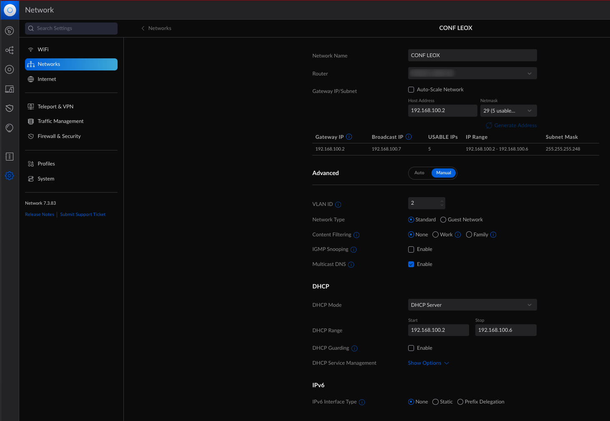
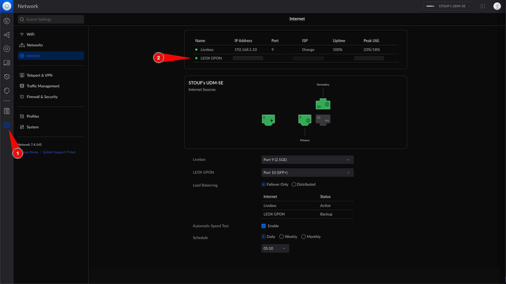
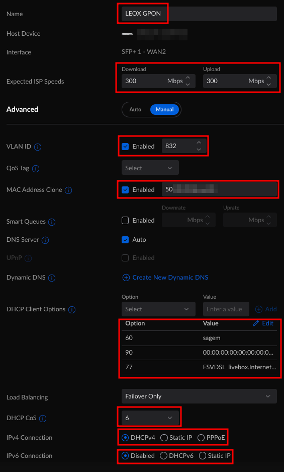

# How to replace Orange LIVEBOX by UDM PRO SE ?

## What do you need ?

- 1 [UDM PRO SE](https://eu.store.ui.com/products/dream-machine-se){target=_blank}
- 1 [LEOX GPON STICK LXT-010S-H](https://www.leolabs.pl/lxt-010s-h.html){target=_blank}
- 1 [SC-APC / SC-UPC Cable](https://amzn.to/3lh8xCA){target=_blank}

!!! info
    You can order the GPON by [sending a mail](mailto:sales@leolabs.pl), or on
    [Contact page](https://www.leolabs.pl/contact.html){target=_blank},
    Price is 70 USD netto/piece (for purchase as an individual, there is
    +23% VAT) delivery. It makes arount 90 EUR (for individual), depends on
    the USD course and delivery destination.

!!! warning
    Be sure to take an SC-APC / SC-UPC Cable (Green / Blue).
    SC-UPC (Blue) will be plugged into the GPON
    SC-APC (Green) will be plugged into your socket in your house/appartment

## STEP 1 : Create configuration network

On the UDM PRO SE :

- Create a new network named : `CONF LEOX`
- Uncheck Auto-Scale Network
- Set Host Address to : `192.168.100.2`
- Set Netmask to `29` to allow 5 IPs
- Set DHCP Mode to : `DHCP Server`
- Set DHCP Rans to :
  - Start : `192.168.100.2`
  - Stop : `192.168.100.6`

<figure markdown>
  [{: style="width:400px"}](screenshots/network-configuration.png)
</figure>

## STEP 2 : Connect the GPON Adapter for configuration

!!! warning
    GPON should be plugged into LAN port (PORT 11)

On the UDM PRO SE :

- Set Port Profile of GPON to network freshly created : `CONF LEOX`
- Apply changes

<figure markdown>
[{: style="width:400px"}](screenshots/port-emplacement.png)
</figure>

## STEP 3 : Allow your computer to access GPON configuration

!!! info inline end
    Because we add a DHCP Server on this network, your computer will
    automatically receive an IP Address on the same subnet as GPON

In order to be able to communicate with GPON,
you need to be on the same subnet as GPON

On the UDM PRO SE :

- Set Port Profile of your computer to `CONF LEOX` port
- Apply changes

<figure markdown>
[{: style="width:400px"}](screenshots/computer-vlan-gpon.png)
</figure>

## STEP 4 : Upgrade GPON to latest version

- Go to [http://192.168.100.1/upgrade.asp](http://192.168.100.1/upgrade.asp)
- Fill the basic authentication with these values :

  - **Username :** `leox`
  - **Password :** `leolabs_7`

- [Download the firmware](firmware/V3.3.4L4rc5)
- Select the firmware on your laptop
- Click on `Upgrade` button
- Confirm you want to upgrade

<figure markdown>
[{: style="width:400px"}](screenshots/upgrade-gpon.png)
</figure>

!!! info inline end
    Today, there is no changelog page on Leolabs website,
    but they had in mind to prepare one.

## STEP 5 : Verify that version is latest one

Once you upgrade to latest version, you should verify that

- Go to [http://192.168.100.1/status.asp](http://192.168.100.1/status.asp)
- Firmware version should be : `V3.3.4L4rc5`

<figure markdown>
[{: style="width:400px"}](screenshots/check-version.png)
</figure>

## STEP 6 : Connect to GPON via telnet

On the UDM PRO SE

- Install telnet package

```bash
apt update
apt install telnet
```

- Initiate a telnet connection to GPON

```bash
telnet 192.168.100.1
Trying 192.168.100.1...
Connected to 192.168.100.1.
Escape character is '^]'.
LXT-010S-H login: leox
Password: leolabs_7
#
```

You are now connected into the GPON

## STEP 7 : Get informations from Livebox

I've made a little application written in
GO to fetch directly informations from Livebox

- Download the app : [GOBOX](https://github.com/StephanGR/gobox)
- Execute it
- Fill IP, Username and Password

You should have something like that :

```bash
> ./gobox
Livebox IP : 192.168.1.1
Username : admin
Password :
✅ Successfully connected to Livebox ! ✅

===========LEOX GPON COMMAND=============
flash set GPON_PLOAM_PASSWD DEFAULT012
flash set OMCI_TM_OPT 0
flash set OMCI_OLT_MODE 1
flash set GPON_SN XXXXXXXXXXXX
flash set PON_VENDOR_ID SMBS
flash set HW_HWVER XXXXXXXXXXXX
flash set OMCI_SW_VER1 XXXXXXXXXXXXX
flash set OMCI_SW_VER2 XXXXXXXXXXXXX
=========================================

==========UDM PRO SE SETTINGS============
NAME              : LEOX GPON
VLAN ID           : 832
MAC Address Clone : XX:XX:XX:XX:XX:XX
DHCP OPTION 60    : sagem
DHCP OPTION 77    : FSVDSL_livebox.Internet.softathome.Livebox5
DHCP OPTION 90    : 00:00:00:00:00:00:00:00:00:00:00:1a:09:00:00:05:58:01:03:41:01:0D:66:74:69:2F:67:66:XX:XX:XX:XX:XX:XX:XX:XX:XX:XX:XX:XX:XX:XX:XX:XX:XX:XX:XX:XX:XX:XX:XX:XX:XX:XX:XX:XX:XX:XX:XX:XX:XX:XX:XX:XX:XX:XX:XX:XX:XX:XX
DHCP CoS          : 6
=========================================
```

## STEP 8 : Configure the GPON

- Go back to GPON configuration
- Copy / Paste all `LEOX GPON COMMAND` fetched on STEP 7
- Verify GPON state

```bash
> diag gpon get onu-state
# IT SHOULD RETURN 05
gpon get onu-state
ONU state: Operation State(O5)
```

!!! info
    - If you have `Operation State(01)` please check your cable
    - If you have `Operation State(05)` it seems to be OK we can continue

Now it's time to find the `OltVendorId`

```bash
> omcicli mib get 131
XXXXXXXXXXXXXXXXXXXXXXXXXXXXXXXXX
OltG
XXXXXXXXXXXXXXXXXXXXXXXXXXXXXXXXX
=================================
EntityId: 0x00
OltVendorId: ALCL
EquipId:
Version:
ToDInfo:
 Sequence number of GEM superframe: 0x0
 Timestamp: secs 0, nanosecs 0
=================================
```

You should have something in `OltVendorId`,
if you have nothing please check previous steps.

Ok so now my `OltVendorId` is `ALCL` which is Alcatel

Tell the GPON that `OMCC_VER` is `128`

```bash
flash set OMCC_VER 128
```

| OltVendorID  | OMCC_VER  |
|:-----------: |:--------: |
| ALCL         | 128       |
| HWTC         | 136       |

!!! success "GPON Configuration is done"

## STEP 9 : Configure the UDM PRO SE

!!! info "Be sure to running `Unifi Network` version >= 7.4.145"

- Go to UDM PRO SE -> Network -> Settings -> Internet
- Select second internet source

<figure markdown>
  [{: style="width:400px"}](screenshots/9.1.png)
</figure>

!!! warning "Fill everything returned by STEP 7"

Apply your changes

You should optain something like this :

<figure markdown>
  [{: style="width:400px"}](screenshots/9.2.png)
</figure>

## STEP 10 : Test in production

- Move the GPON from port `11` to port `10`
- Wait a bit
- You should see an IP address on Network -> Settings -> Internet :

<figure markdown>
  [{: style="width:400px"}](screenshots/10.png)
</figure>

!!! success "You are now connected to internet without using Orange Livebox anymore"

!!! Warning
    If you have a private IP like `172.16.152.14` there is a misconfiguration.
    Check all steps and try again
