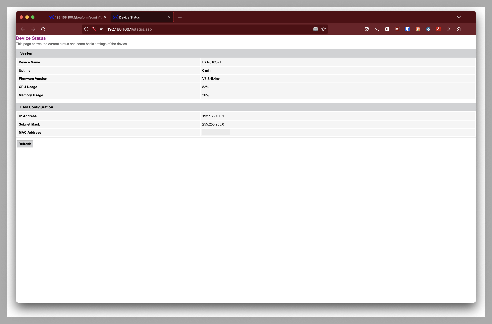

# How to replace Orange LIVEBOX by UDM PRO SE ?

## What do you need ?

- 1 [UDM PRO SE](https://eu.store.ui.com/products/dream-machine-se){target=_blank}
- 1 [LEOX GPON STICK LXT-010S-H](https://www.leolabs.pl/lxt-010s-h.html){target=_blank}

You can order the GPON on [xbest.pl](http://xbest.pl/index.php?p4878,sfp-gpon-stick-leox-lxt-010s-h-1-25-2-5g-sm-sc-20km-tx1310-rx1490-ddm-class-b){target=_blank},
 it costs me around 90€ with delivery

## STEP 1 : Create configuration network

On the UDM PRO SE :

- Create a new network named : `CONF LEOX`
- Uncheck Auto-Scale Network
- Set Host Address to : `192.168.100.2`
- Set Netmask to `29` to allow 5 IPs
- Set DHCP Mode to : `DHCP Server`
- Set DHCP Rans to :
  - Start : `192.168.100.2`
  - Stop : `192.168.100.6`

[{: style="width:400px"}](screenshots/network-configuration.png)

## STEP 2 : Connect the GPON Adapter for configuration

!!! warning
    GPON should be plugged into LAN port (PORT 11)

On the UDM PRO SE :

- Set Port Profile of GPON to network freshly created : `CONF LEOX`
- Apply changes

[{: style="width:400px"}](screenshots/port-emplacement.png)

## STEP 3 : Allow your computer to access GPON configuration

!!! info inline end
    Because we add a DHCP Server on this network, your computer will
    automatically receive an IP Address on the same subnet as GPON

In order to be able to communicate with GPON,
you need to be on the same subnet as GPON

On the UDM PRO SE :

- Set Port Profile of your computer to `CONF LEOX` port
- Apply changes

[{: style="width:400px"}](screenshots/computer-vlan-gpon.png)

## STEP 4 : Upgrade GPON to latest version

- Go to [http://192.168.100.1/upgrade.asp](http://192.168.100.1/upgrade.asp)
- Fill the basic authentication with these values :

  - **Username :** `leox`
  - **Password :** `leolabs_7`

- [Download the firmware](firmware/V3.3.4L4rc4)
- Select the firmware on your laptop
- Click on `Upgrade` button
- Confirm you want to upgrade

[{: style="width:400px"}](screenshots/upgrade-gpon.png)

## STEP 5 : Verify that version is latest one

- Once you upgrade to latest version, you should verify that
- Go to [http://192.168.100.1/status.asp](http://192.168.100.1/status.asp)
- Firmware version should be : `V3.3.4L4rc4`

[{: style="width:400px"}](screenshots/check-version.png)

## STEP 6 : Connect to GPON via telnet

On the UDM PRO SE

- Install telnet package

```bash
apt update
apt install telnet
```

- Initiate a telnet connection to GPON

```bash
telnet 192.168.100.1
Trying 192.168.100.1...
Connected to 192.168.100.1.
Escape character is '^]'.
LXT-010S-H login: leox
Password: leolabs_7
#
```

You are now connected into the GPON
